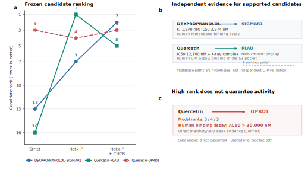

# ETCM2.0 代表性案例表与图版规范

## 1. 用途

本文档将冻结的 ETCM2.0 Top-K 独立核验结果整理为论文可用的案例表和图版
输入。它不重新训练模型、不改变 checkpoint、不替换候选，也不把外部证据
回写到模型。

冻结清单：

```text
configs/etcm_topk_representative_cases.json
```

选择规则为：

1. 纳入全部 B1 候选；
2. 纳入全部 Conflict 候选作为失败案例；
3. 不使用模型分数、排名提升或路径数量决定是否入选；
4. 不允许用后续检索结果替换案例。

## 2. 论文案例表

| 案例 | 角色 | Strict rank | Hctx-P rank | Hctx-P+CHCR rank | 最佳提升 | 外部证据 | 页面路径 |
|---|---|---:|---:|---:|---:|---|---|
| DEXPROPRANOLOL–SIGMAR1 | B1 正向 | 13 | 7 | 2 | +11 | Human Sigma1 radioligand binding：Ki 1670 nM、IC50 3974 nM | 无 C-H-D-P 路径 |
| Quercetin–PLAU | B1 正向 | 16 | 1 | 5 | +15 | Human uPA IC50 12100 nM；quercetin-uPA S1 pocket X-ray 复合物结构 | 8 条，仅作 post-hoc 假设 |
| Quercetin–OPRD1 | Conflict | 3 | 4 | 3 | 0 | Human OPRD1 binding AC50 >30000 nM；来源研究按 assay ceiling 视为 inactive/very weak | 无 C-H-D-P 路径 |

`最佳提升 = Strict rank - 最优上下文模型 rank`，正值表示候选向前移动。
排名越小越好。三个案例均来自检索前冻结清单，因此不能根据结果替换。

## 3. 证据来源

### 3.1 DEXPROPRANOLOL–SIGMAR1

```text
Compound: CHEMBL275742
Target: CHEMBL287 / UniProt Q99720
Assay: CHEMBL1909110
Activities: 7808827, 7808828
Ki: 1670 nM
IC50: 3974 nM
```

证据类型为 human Sigma1 radioligand-binding。该案例支持“模型前移了一个
具有独立定量证据的候选”，但不能证明排名提升由特定药材机制导致。

### 3.2 Quercetin–PLAU

```text
Compound: CHEMBL50
Target: CHEMBL3286 / UniProt P00749
Assay: CHEMBL2428680
Activity: 13442121
IC50: 12100 nM
PMID: 24610996
DOI: 10.1007/s00044-013-0829-4
```

另有 X-ray 结构论文：

```text
PMID: 28644504
DOI: 10.1039/C6FO01825D
Finding: quercetin binds in the uPA S1 pocket
```

ETCM 页面还提供 Quercetin–JingDaJi
(`Euphorbia pekinensis Rupr.`) 的 Herb 来源。8 条 C-H-D-P 路径都来自
这一药材，但 H-D 与完整网络高度耦合，路径只能画成虚线机制假设。

### 3.3 Quercetin–OPRD1

```text
Compound: CHEMBL50
Target: CHEMBL236 / UniProt P41143
Assay: CHEMBL5291852
Activity: 25153945
AC50: >30000 nM
PMID: 37468498
DOI: 10.1038/s41467-023-40064-9
```

该案例必须保留。它说明高排名不等于已验证活性，也防止案例研究只展示成功
预测。网络药理和 docking 命中不能覆盖直接 inactivity/very weak assay。

## 4. 三面板图设计

### Panel A：冻结案例的排名轨迹

用三个方法作为横轴：

```text
Strict-HDCTI -> Hctx-P -> Hctx-P+CHCR
```

纵轴为 rank，方向反转，使 rank 1 位于顶部。绘制三个 pair 的轨迹：

```text
DEXPROPRANOLOL–SIGMAR1: 13 -> 7 -> 2
Quercetin–PLAU:         16 -> 1 -> 5
Quercetin–OPRD1:         3 -> 4 -> 3
```

B1 使用实心标记，Conflict 使用红色叉号或警示标记。

### Panel B：正向证据来源

分别展示：

```text
DEXPROPRANOLOL -> SIGMAR1 -> Ki / IC50
Quercetin -> PLAU -> IC50 + X-ray structure
```

直接实验边使用实线。Quercetin 的 JingDaJi 药材来源可作为模型侧上下文
显示，但必须标注为 `model-side Herb context`，不能与外部 binding 证据合并。

### Panel C：失败案例与证据边界

展示：

```text
Quercetin -> OPRD1
model rank: 3 / 4 / 3
external assay: AC50 >30000 nM
```

使用 Conflict 标记，并附一句：

```text
High rank does not imply validated target activity.
```

若展示 Quercetin–PLAU 的 ETCM 疾病路径，必须使用虚线并注明
`post-hoc database path hypothesis`。SIGMAR1 和 OPRD1 不得补画不存在的
C-H-D-P 路径。

## 5. 推荐图注

> Representative ETCM2.0 case study under frozen Top-K predictions.
> Candidate pairs were selected by evidence grade after a search list had been
> frozen, without changing checkpoints or rankings. Hctx-P and CHCR moved two
> independently supported targets toward the top of the candidate list.
> Quercetin–OPRD1 is retained as a conflict case, illustrating that a high model
> rank is not equivalent to experimentally validated activity. Solid edges
> denote direct experimental evidence, whereas dashed ETCM paths denote
> post-hoc database hypotheses only.

## 6. 禁止表述

- 不将 `2/15` 写成模型 precision；
- 不将 E 级候选写成真实负例；
- 不将页面路径写成独立实验验证；
- 不将 Hctx-P/CHCR 的排名变化写成因果机制；
- 不删除或隐藏 Quercetin–OPRD1 冲突案例；
- 不声称三个案例代表 ETCM2.0 全库表现。

## 7. 图版产物

三面板图已使用 Python 生成，绘图过程只读取冻结 JSON，不重新运行
TensorFlow：

```text
figures/etcm_case_study/etcm_representative_cases.svg
figures/etcm_case_study/etcm_representative_cases.pdf
figures/etcm_case_study/etcm_representative_cases.png
figures/etcm_case_study/source_data.tsv
```

其中 SVG 和 PDF 为论文排版用矢量文件，PNG 仅用于快速预览。SVG 保留可编辑
文本对象，图宽固定为 183 mm。可通过以下命令重建：

```bash
MPLCONFIGDIR=/tmp/hdcti-mpl \
  /home/zry/.conda/envs/HDCTI/bin/python \
  figures/etcm_case_study/figure_etcm_cases.py
```



下一步仅需将该图、案例表和本文件第 5 节图注并入最终 Results/Case Study。
